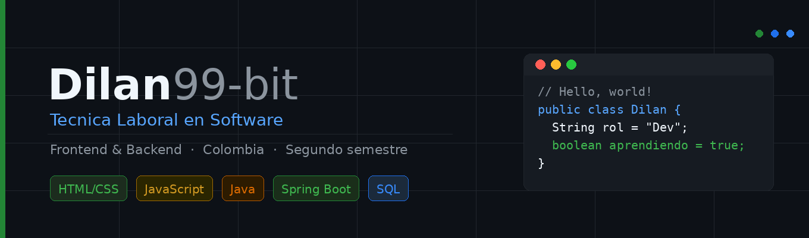

# Hola, soy Dilan 👨‍💻

**Técnica Laboral en Software · Full Stack · Colombia 🇨🇴**

Construyendo proyectos reales mientras sigo creciendo como desarrollador.

---

## 🧑‍💻 Sobre mí

Soy estudiante de Técnica Laboral en Software, apasionado por el desarrollo Frontend, Backend y el manejo de datos. Me gusta convertir ideas en soluciones funcionales utilizando código limpio, estructurado y fácil de mantener.

- 🎓 Técnica Laboral en Software
- 💻 Desarrollo Frontend & Backend
- 🐍 Desarrollo con Python y análisis/manipulación de datos con Pandas
- ⚛️ Desarrollo web con React, JavaScript, HTML y CSS
- ☕ Desarrollo Backend con Java y Spring Boot
- 🗄️ Manejo de bases de datos con SQL y MySQL
- 🧪 Uso de Faker para generación de datos simulados en Python
- 🎯 Meta: Construir aplicaciones web completas y profesionales
- 🤝 Abierto a colaborar en proyectos académicos y personales
- 📍 Colombia

---

## 🛠️ Tecnologías y herramientas

### Frontend

### Backend

### Datos & Bases de datos

### Herramientas

---

## 📊 Estadísticas de GitHub

---

## 🔨 Proyectos en los que estoy trabajando actualmente

### 🏢 Cesde Empresas *(Académico)*
Proyecto académico integral en desarrollo, orientado a la gestión empresarial. Aplica de forma conjunta todas las tecnologías que he aprendido hasta el momento: backend con Java y Spring Boot, base de datos relacional con MySQL (modelada y administrada desde MySQL Workbench), frontend con HTML, CSS, JavaScript y React, y un módulo de análisis de datos en Python utilizando Pandas para el procesamiento de la información y Faker para la generación de datos simulados de prueba.

`Java` `Spring Boot` `MySQL` `MySQL Workbench` `HTML` `CSS` `JavaScript` `React` `Python` `Pandas` `Faker`

🚧 *Proyecto en construcción — próximamente disponible en mi repositorio.*

---

## 🚀 Proyectos destacados

### 🏥 clinica.demo
Aplicación backend para la gestión de citas médicas de uso interno en clínicas privadas. Desarrollada con Java y Spring Boot, conectada a una base de datos SQL utilizando MySQL.

`Java` `Spring Boot` `MySQL` `SQL`

---

### 💻 InterasClinicademo
Interfaz frontend de una aplicación para gestión de citas médicas. Incluye login, registro de usuarios y formulario para agendar citas, desarrollada mediante manipulación del DOM.

`HTML` `CSS` `JavaScript`

---

### 🎮 JuegoAdivinaNumero_Es-
Videojuego de adivinar el número desarrollado con JavaScript puro y manipulación del DOM. El jugador debe encontrar el número secreto utilizando pistas de mayor o menor.

`JavaScript` `HTML` `CSS`

---

### 🍰 DulcesDelicias
Proyecto colaborativo de desarrollo frontend para una tienda de dulces y postres.

`HTML` `CSS`

---

### 📚 Biblioteca_db
Proyecto académico de base de datos para la gestión de una biblioteca, desarrollado como parte de mi formación en programación y bases de datos.

`Java` `SQL`

---

## 📫 Contacto

---

*"El mejor código es el que se puede leer, entender y mejorar."*

